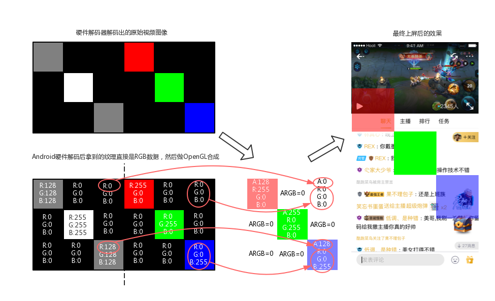
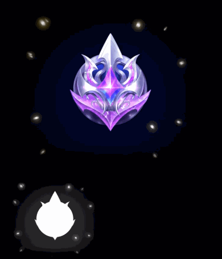
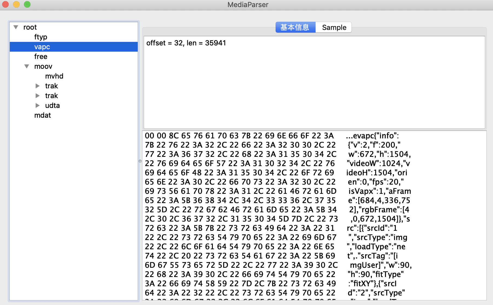
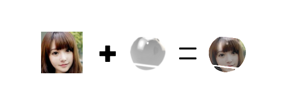
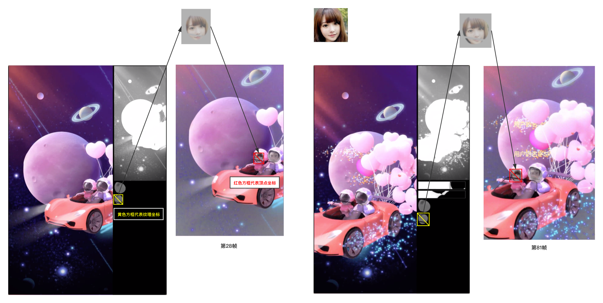

## 1. VAP

VAP（Video Animation Player）是企鹅电竞开发，用于播放酷炫动画的实现方案。

* 相比Webp, Apng动图方案，具有高压缩率(素材更小)、硬件解码(解码更快)的优点
* 相比Lottie，能实现更复杂的动画效果(比如粒子特效)

特效展示：

而且VAP还能在动画中融入自定义的属性（比如用户名称, 头像）

## 2. 项目背景

企鹅电竞是个直播平台，需要在直播间里显示酷炫的送礼动画。

动画越酷炫，对素材大小与解码性能要求越高，调研了很多方案，先给对比表：

-|文件大小|解码方式|特效支持
---|---|---|---
Lottie|无法导出|软解|无粒子特效
GIF|4.6M|软解|只支持8位色彩
Apng|10.6M|软解|全支持
Webp|9.2M|软解|全支持
mp4|1.5M|硬解|无透明背景
VAP|***1.5M***|***硬解***|***全支持***

* 测试参数：
	* 手机: 小米mix3
	* 素材: 736 × 576 80帧
	* Apng: 75质量; Webp: 75质量; VAP: 2000码率

调研方案：

1. 矢量动画方案（代表Lottie）: Lottie矢量动画压缩率很高，但因为无法显示特殊效果（比如粒子特效），所以此方案不适合；
2. 动图方案（代表GIF, Apng, Webp）:
	* GIF: 只支持8位颜色，颜色丢失严重，解码性能低，无法满足特效效果；
	* Apng, Webp: 能够满足特效效果，但文件大，软解效率低（低端的手机上，比如当年的红米1，解码过程甚至能导致整个直播间卡顿），这些问题很难接受；
3. 视频方案（代表mp4）: 采用H264编码，相比动图方案，有很高的压缩率，硬件解码效率很高，缺点很明显，无法支持透明背景；

调研后发现，要么特效表现无法达到要求（Lottie, GIF），要么文件太大而且还是软解（Webp, Apng），要么不支持透明度（mp4），这些方案都不能满足我们的需求，高性能动画组件VAP诞生。

## 3. 实现原理

### 方案选择

mp4视频方案无论从效果、大小与解码性能上都是最优的，但H264的里存的是YUV数据，并没有带透明通道。VAP方案基于mp4，解决视频里透明度的问题，这样就能兼具更好的压缩效率，与更好的解码性能。

### 视频透明度实现

H264解码出来每一帧的数据是YUV，转换为RGB后是不带Alpha通道的，而我们可以在视频中额外开辟一块区域，在RGB通道里存储Alpha的值，最后利用OpenGL将这些数据合成为ARGB图像（带透明通道的图像）。

举个例子，解码器解码出一帧原始图像后，合成原理如图所示：

每一帧都做相同的事情，就是得到带透明度的视频，实际视频如下：

原始视频|最终效果
---|---
|

原始视频中，黑白区域承载Alpha数据。VAP最新版本里实现了Alpha区域大小可变，通过缩小Alpha区域大小，在不影响最终显示效果的同时，能有效减少视频分辨率，提高机型兼容性，而且为VAP的融合特性空余出多余的区域。

### 动画配置信息

动画播放过程中，需要一些配置信息协助播放（比如Alpha区域声明，包括融合动画信息），配置是JSON格式。为了组件更方便使用，所有相关文件都合并到mp4文件里，这样播放动画只需要一个mp4文件即可。

mp4的组织方式与JSON的key-value组织方式很像，被称为一个BOX，我们创建一个新的BOX（vapc VAP Config），JSON内容放到这个BOX里，播放前先读取此BOX然后播放（ps: mp4规范里定义如果无法识别的BOX自动忽略，不影响mp4正常播放流程）。

### VAP融合动画

VAP还支持在动画中融入自定义属性，比如用户名称, 头像。我们称其为VAP融合动画。

视频内容无法直接实现属性的插入，只能曲线救国，通过对属性图片进行修剪，欺骗用户的眼睛，让其看起来像是在视频内容里，实现最终的融合效果（效果如文章开头展示）。

为实现属性图片处理，需要引入“遮罩”素材，利用遮罩与属性图片进行Porter-Duff操作，就能得到需要的形状

再将结果贴到视频对应坐标位置，就能实现最后的融合效果。

“遮罩”素材保存在每一帧视频内容里，之前通过缩小Aplha区域，空出来的区域得到利用。实现原理如图所示

实际视频

## 配套工具

为大家更方便的使用组件，还有配套的素材制作工具

## License

VAP is under the MIT license. See the LICENSE file for details.
