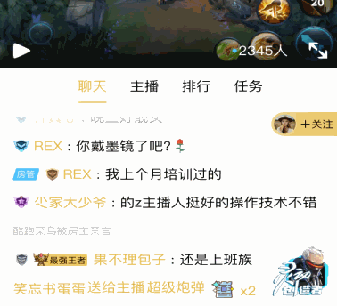

# VAP

简体中文 | [English](./README_en.md)

VAP（Video Animation Player）是企鹅电竞开发，用于播放酷炫动画的实现方案。

* 相比Webp, Apng动图方案，具有高压缩率(素材更小)、硬件解码(解码更快)的优点
* 相比Lottie，能实现更复杂的动画效果(比如粒子特效)

项目详细介绍请参考 [Introduction.md](./Introduction.md)

特效展示：

[展示主页](https://egame.qq.com/vap)

而且VAP还能在动画中融入自定义的属性（比如用户名称, 头像）

## 性能简述

-|文件大小|解码方式|特效支持
---|---|---|---
Lottie|无法导出|软解|无粒子特效
GIF|4.6M|软解|只支持8位色彩
Apng|10.6M|软解|全支持
Webp|9.2M|软解|全支持
mp4|1.5M|硬解|无透明背景
VAP|***1.5M***|***硬解***|***全支持***

实验参数参考 [Introduction.md](./Introduction.md)

## 平台支持

支持：[Android](./Android), [iOS](./iOS), [web](./web). 接入说明在对应平台目录中

素材制作工具：[VapTool](./tool) (工具使用说明在tool目录下)

播放预览工具：[Mac](https://github.com/Tencent/vap/releases/download/VapPreview1.2.0/vap-player_mac_1.2.0.zip), [Windows](https://github.com/Tencent/vap/releases/download/VapPreview1.2.0/vap-player_1.2.0.exe)

## QQ交流群

遇到任何问题或者有好的建议，欢迎提issues，或者加入QQ群交流

VAP交流群：719738292

## FAQ

[常见问题解答](https://github.com/Tencent/vap/wiki/FAQ)

## 已接入APP

需要显示自己App图标，可以加入QQ群，群公告里有App图标加入说明

## License

VAP is under the MIT license. See the [LICENSE](./LICENSE.txt) file for details.
