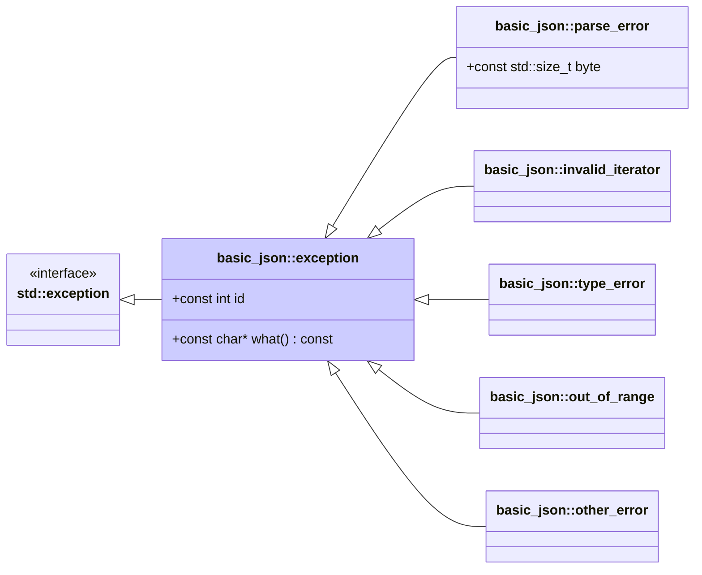

# <small>nlohmann::basic_json::</small>exception

```cpp
class exception : public std::exception;
```

This class is an extension of [`std::exception`](https://en.cppreference.com/w/cpp/error/exception) objects with a
member `id` for exception ids. It is used as the base class for all exceptions thrown by the `basic_json` class. This
class can hence be used as "wildcard" to catch exceptions, see example below.



Subclasses:

- [`parse_error`](parse_error.md) for exceptions indicating a parse error
- [`invalid_iterator`](invalid_iterator.md) for exceptions indicating errors with iterators
- [`type_error`](type_error.md) for exceptions indicating executing a member function with a wrong type
- [`out_of_range`](out_of_range.md) for exceptions indicating access out of the defined range
- [`other_error`](other_error.md) for exceptions indicating other library errors

## Member functions

- **what** - returns explanatory string

## Member variables

- **id** - the id of the exception

## Notes

To have nothrow-copy-constructible exceptions, we internally use `std::runtime_error` which can cope with
arbitrary-length error messages. Intermediate strings are built with static functions and then passed to the actual
constructor.

## Examples

??? example

    The following code shows how arbitrary library exceptions can be caught.
    
    ```cpp
    --8<-- "examples/exception.cpp"
    ```
    
    Output:
    
    ```json
    --8<-- "examples/exception.output"
    ```

## See also

[List of exceptions](../../home/exceptions.md)

## Version history

- Since version 3.0.0.
