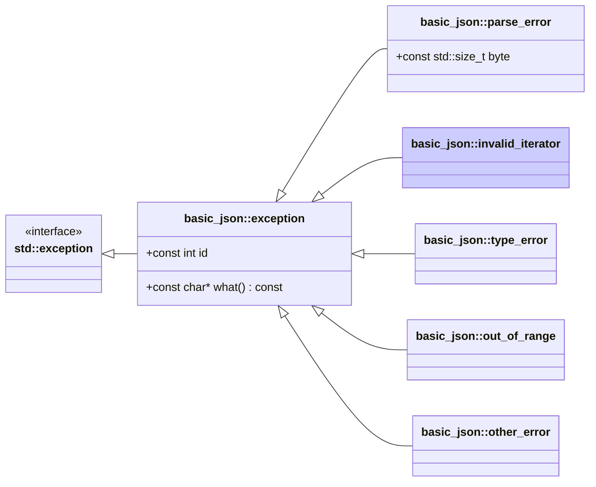

# <small>nlohmann::basic_json::</small>invalid_iterator

```cpp
class invalid_iterator : public exception;
```

This exception is thrown if iterators passed to a library function do not match the expected semantics.

Exceptions have ids 2xx (see [list of iterator errors](../../home/exceptions.md#iterator-errors)).



## Member functions

- **what** - returns explanatory string

## Member variables

- **id** - the id of the exception

## Examples

??? example

    The following code shows how a `invalid_iterator` exception can be caught.
    
    ```cpp
    --8<-- "examples/invalid_iterator.cpp"
    ```
    
    Output:
    
    ```json
    --8<-- "examples/invalid_iterator.output"
    ```

## See also

- [List of iterator errors](../../home/exceptions.md#iterator-errors)
- [`parse_error`](parse_error.md) for exceptions indicating a parse error
- [`type_error`](type_error.md) for exceptions indicating executing a member function with a wrong type
- [`out_of_range`](out_of_range.md) for exceptions indicating access out of the defined range
- [`other_error`](other_error.md) for exceptions indicating other library errors

## Version history

- Since version 3.0.0.
