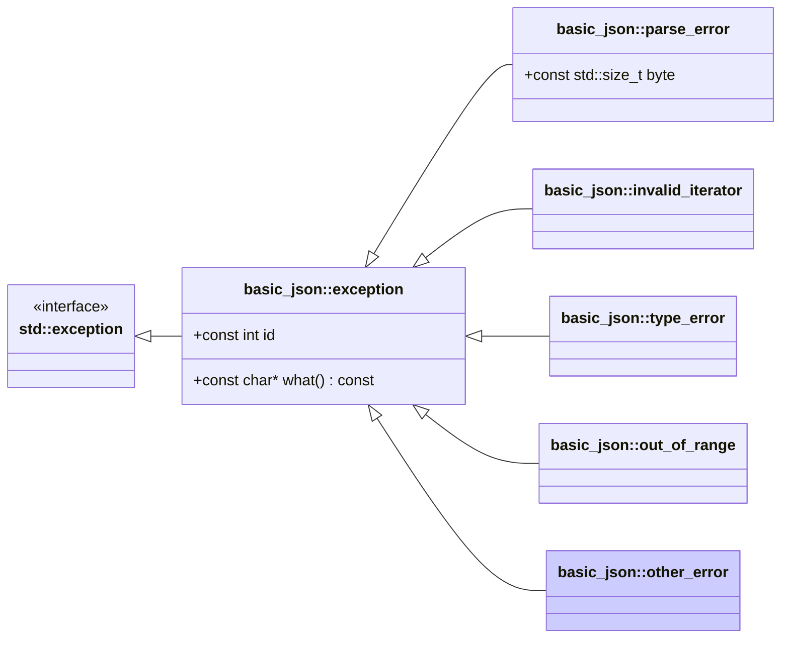

# <small>nlohmann::basic_json::</small>other_error

```cpp
class other_error : public exception;
```

This exception is thrown in case of errors that cannot be classified with the other exception types.

Exceptions have ids 5xx (see [list of other errors](../../home/exceptions.md#further-exceptions)).



## Member functions

- **what** - returns explanatory string

## Member variables

- **id** - the id of the exception

## Examples

??? example

    The following code shows how a `other_error` exception can be caught.
    
    ```cpp
    --8<-- "examples/other_error.cpp"
    ```
    
    Output:
    
    ```json
    --8<-- "examples/other_error.output"
    ```

## See also

- [List of other errors](../../home/exceptions.md#further-exceptions)
- [`parse_error`](parse_error.md) for exceptions indicating a parse error
- [`invalid_iterator`](invalid_iterator.md) for exceptions indicating errors with iterators
- [`type_error`](type_error.md) for exceptions indicating executing a member function with a wrong type
- [`out_of_range`](out_of_range.md) for exceptions indicating access out of the defined range

## Version history

- Since version 3.0.0.
