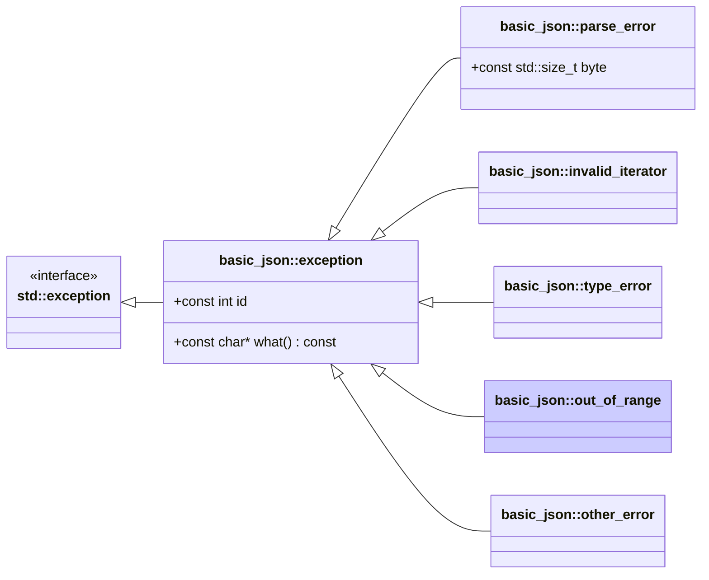

# <small>nlohmann::basic_json::</small>out_of_range

```cpp
class out_of_range : public exception;
```

This exception is thrown in case a library function is called on an input parameter that exceeds the expected range, for
instance in case of array indices or nonexisting object keys.

Exceptions have ids 4xx (see [list of out-of-range errors](../../home/exceptions.md#out-of-range)).



## Member functions

- **what** - returns explanatory string

## Member variables

- **id** - the id of the exception

## Examples

??? example

    The following code shows how a `out_of_range` exception can be caught.
    
    ```cpp
    --8<-- "examples/out_of_range.cpp"
    ```
    
    Output:
    
    ```json
    --8<-- "examples/out_of_range.output"
    ```

## See also

- [List of out-of-range errors](../../home/exceptions.md#out-of-range)
- [`parse_error`](parse_error.md) for exceptions indicating a parse error
- [`invalid_iterator`](invalid_iterator.md) for exceptions indicating errors with iterators
- [`type_error`](type_error.md) for exceptions indicating executing a member function with a wrong type
- [`other_error`](other_error.md) for exceptions indicating other library errors

## Version history

- Since version 3.0.0.
