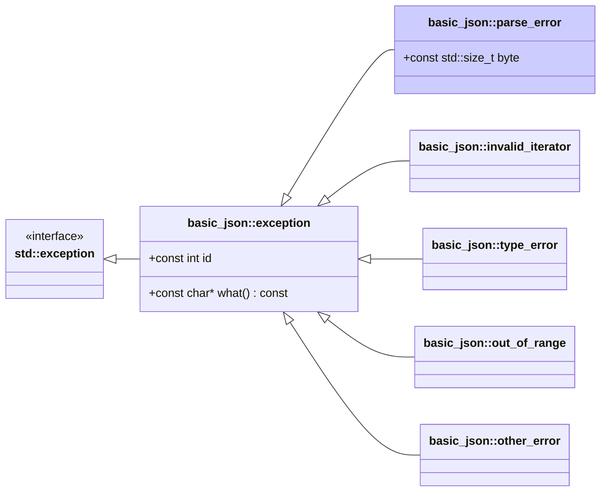

# <small>nlohmann::basic_json::</small>parse_error

```cpp
class parse_error : public exception;
```

This exception is thrown by the library when a parse error occurs. Parse errors can occur during the deserialization of
JSON text, BSON, CBOR, MessagePack, UBJSON, as well as when using JSON Patch.

Member `byte` holds the byte index of the last read character in the input file (see note below).

Exceptions have ids 1xx (see [list of parse errors](../../home/exceptions.md#parse-errors)).



## Member functions

- **what** - returns explanatory string

## Member variables

- **id** - the id of the exception
- **byte** - byte index of the parse error

## Notes

For an input with $n$ bytes, 1 is the index of the first character and $n+1$ is the index of the terminating null byte
or the end of file. This also holds true when reading a byte vector for binary formats.

## Examples

??? example

    The following code shows how a `parse_error` exception can be caught.
    
    ```cpp
    --8<-- "examples/parse_error.cpp"
    ```
    
    Output:
    
    ```json
    --8<-- "examples/parse_error.output"
    ```

## See also

- [List of parse errors](../../home/exceptions.md#parse-errors)
- [`invalid_iterator`](invalid_iterator.md) for exceptions indicating errors with iterators
- [`type_error`](type_error.md) for exceptions indicating executing a member function with a wrong type
- [`out_of_range`](out_of_range.md) for exceptions indicating access out of the defined range
- [`other_error`](other_error.md) for exceptions indicating other library errors

## Version history

- Since version 3.0.0.
