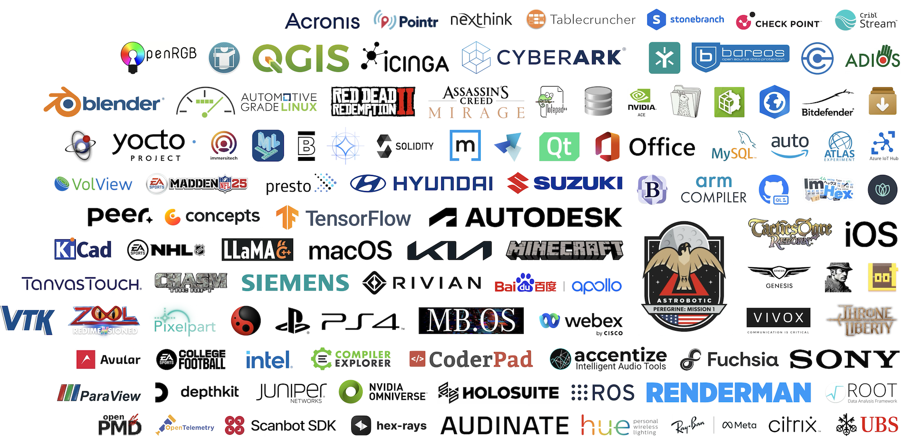

# Customers

The library is used in multiple projects, applications, operating systems, etc. The list below is not exhaustive, but
the result of an internet search. If you know further customers of the library, [please let me know](mailto:mail@nlohmann.me).

## Space Exploration

- [**Peregrine Lunar Lander Flight 01**](https://en.wikipedia.org/wiki/Peregrine_Mission_One) - The library was utilized for payload management in the **Peregrine Moon Lander**, developed by **Astrobotic Technology** and launched as part of NASA's **Commercial Lunar Payload Services (CLPS)** program. After six days in orbit, the spacecraft was intentionally redirected into Earth's atmosphere, where it burned up over the Pacific Ocean on **January 18, 2024**.

## Automotive

- [**Alexa Auto SDK**](https://github.com/alexa/alexa-auto-sdk), a software development kit enabling the integration of Alexa into automotive systems
- [**Apollo**](https://github.com/ApolloAuto/apollo), a framework for building autonomous driving systems
- [**Automotive Grade Linux (AGL)**](https://download.automotivelinux.org/AGL/release/jellyfish/latest/qemux86-64/deploy/licenses/nlohmann-json/): a collaborative open-source platform for automotive software development
- [**Genesis Motor** (infotainment)](http://webmanual.genesis.com/ccIC/AVNT/JW/KOR/English/reference010.html), a luxury automotive brand
- [**Hyundai** (infotainment)](https://www.hyundai.com/wsvc/ww/download.file.do?id=/content/hyundai/ww/data/opensource/data/GN7-2022/licenseCode/info), a global automotive brand
- [**Kia** (infotainment)](http://webmanual.kia.com/PREM_GEN6/AVNT/RJPE/KOR/Korean/reference010.html), a global automotive brand
- [**Mercedes-Benz Operating System (MB.OS)**](https://group.mercedes-benz.com/careers/about-us/mercedes-benz-operating-system/), a core component of the vehicle software ecosystem from Mercedes-Benz
- [**Rivian** (infotainment)](https://assets.ctfassets.net/2md5qhoeajym/3cwyo4eoufk4yingUwusFt/ded2c47da620fdfc99c88c7156d2c1d8/In-Vehicle_OSS_Attribution_2024__11-24_.pdf), an electric vehicle manufacturer
- [**Suzuki** (infotainment)](https://www.globalsuzuki.com/motorcycle/ipc/oss/oss_48KA_00.pdf), a global automotive and motorcycle manufacturer

## Gaming and Entertainment

- [**Assassin's Creed: Mirage**](https://www.mobygames.com/person/1195889/niels-lohmann/credits/): a stealth-action game set in the Middle East, focusing on the journey of a young assassin with classic parkour and stealth mechanics
- [**Chasm: The Rift**](https://www.mobygames.com/person/1195889/niels-lohmann/credits/): a first-person shooter blending horror and adventure, where players navigate dark realms and battle monsters
- [**College Football 25**](https://www.mobygames.com/person/1195889/niels-lohmann/credits/): a college football simulation game featuring gameplay that mimics real-life college teams and competitions
- [**Concepts**](https://concepts.app/en/licenses): a digital sketching app designed for creative professionals, offering flexible drawing tools for illustration, design, and brainstorming
- [**Depthkit**](https://www.depthkit.tv/third-party-licenses): a tool for creating and capturing volumetric video, enabling immersive 3D experiences and interactive content
- [**immersivetech**](https://immersitech.io/open-source-third-party-software/): a technology company focused on immersive experiences, providing tools and solutions for virtual and augmented reality applications
- [**LOOT**](https://loot.readthedocs.io/_/downloads/en/0.13.0/pdf/), a tool for optimizing the load order of game plugins, commonly used in The Elder Scrolls and Fallout series
- [**Madden NFL 25**](https://www.mobygames.com/person/1195889/niels-lohmann/credits/): a sports simulation game capturing the excitement of American football with realistic gameplay and team management features
- [**Marne**](https://marne.io/licenses), an unofficial private server platform for hosting custom Battlefield 1 game experiences
- [**Minecraft**](https://www.minecraft.net/zh-hant/attribution), a popular sandbox video game
- [**NHL 22**](https://www.mobygames.com/person/1195889/niels-lohmann/credits/): a hockey simulation game offering realistic gameplay, team management, and various modes to enhance the hockey experience
- [**Pixelpart**](https://pixelpart.net/documentation/book/third-party.html): a 2D animation and video compositing software that allows users to create animated graphics and visual effects with a focus on simplicity and ease of use
- [**Red Dead Redemption II**](https://www.mobygames.com/person/1195889/niels-lohmann/credits/): an open-world action-adventure game following an outlaw's story in the late 1800s, emphasizing deep storytelling and immersive gameplay
- [**Tactics Ogre: Reborn**](https://www.square-enix-games.com/en_US/documents/tactics-ogre-reborn-pc-installer-software-and-associated-plug-ins-disclosure), a tactical role-playing game featuring strategic battles and deep storytelling elements
- [**Throne and Liberty**](https://www.amazon.com/gp/help/customer/display.html?nodeId=T7fLNw5oAevCMtJFPj&pop-up=1), an MMORPG that offers an expansive fantasy world with dynamic gameplay and immersive storytelling
- [**Unity Vivox**](https://docs.unity3d.com/Packages/com.unity.services.vivox@15.1/license/Third%20Party%20Notices.html), a communication service that enables voice and text chat functionality in multiplayer games developed with Unity
- [**Zool: Redimensioned**](https://www.mobygames.com/person/1195889/niels-lohmann/credits/): a modern reimagining of the classic platformer featuring fast-paced gameplay and vibrant environments

## Consumer Electronics

- [**Audinate**](https://www.audinate.com/legal/software-licensing/dante-av-h-open-source-licenses/): a provider of networked audio solutions specializing in Dante technology, which facilitates high-quality digital audio transport over IP networks
- [**Cisco Webex Desk Camera**](https://www.cisco.com/c/dam/en_us/about/doing_business/open_source/docs/CiscoWebexDeskCamera-23-1622100417.pdf), a video camera designed for professional-quality video conferencing and remote collaboration
- [**Philips Hue Personal Wireless Lighting**](http://2ak5ape.257.cz/): a smart lighting system for customizable and wireless home illumination
- [**Ray-Ban Meta Smart glasses**](https://www.meta.com/de/en/legal/smart-glasses/third-party-notices-android/03/), a pair of smart glasses designed for capturing photos and videos with integrated connectivity and social features
- [**Siemens SINEMA Remote Connect**](https://cache.industry.siemens.com/dl/files/790/109793790/att_1054961/v2/OSS_SINEMA-RC_86.pdf), a remote connectivity solution for monitoring and managing industrial networks and devices securely
- [**Sony PlayStation 4**](https://doc.dl.playstation.net/doc/ps4-oss/index.html), a gaming console developed by Sony that offers a wide range of games and multimedia entertainment features
- [**Sony Virtual Webcam Driver for Remote Camera**](https://helpguide.sony.net/rc/vwd/v1/zh-cn/print.pdf), a software driver that enables the use of Sony cameras as virtual webcams for video conferencing and streaming

## Operating Systems

- [**Apple iOS and macOS**](https://www.apple.com/macos), a family of operating systems developed by Apple, including iOS for mobile devices and macOS for desktop computers
- [**Google Fuchsia**](https://fuchsia.googlesource.com/third_party/json/), an open-source operating system developed by Google, designed to be secure, updatable, and adaptable across various devices
- [**SerenityOS**](https://github.com/SerenityOS/serenity), an open-source operating system that aims to provide a simple and beautiful user experience with a focus on simplicity and elegance
- [**Yocto**](http://ftp.emacinc.com/openembedded-sw/kirkstone-icop-5.15-kirkstone-6.0/archive-2024-10/pn8m-090t-ppc/licenses/nlohmann-json/): a Linux-based build system for creating custom operating systems and software distributions, tailored for embedded devices and IoT applications

## Development Tools and IDEs

- [**Accentize SpectralBalance**](https://www.accentize.com/products/SpectralBalanceManual.pdf), an adaptive speech analysis tool designed to enhance audio quality by optimizing frequency balance in recordings
- [**Arm Compiler for Linux**](https://documentation-service.arm.com/static/66558e9d876c8d213b7843e4), a software development toolchain for compiling and optimizing applications on Arm-based Linux systems
- [**BBEdit**](https://s3.amazonaws.com/BBSW-download/BBEdit_15.1.2_User_Manual.pdf), a professional text and code editor for macOS
- [**CoderPad**](https://coderpad.io), a collaborative coding platform that enables real-time code interviews and assessments for developers; the library is included in every CoderPad instance and can be accessed with a simple `#include "json.hpp"`
- [**Compiler Explorer**](https://godbolt.org), a web-based tool that allows users to write, compile, and visualize the assembly output of code in various programming languages; the library is readily available and accessible with the directive `#include <nlohmann/json.hpp>`.
- [**GitHub CodeQL**](https://github.com/github/codeql), a code analysis tool used for identifying security vulnerabilities and bugs in software through semantic queries
- [**Hex-Rays**](https://docs.hex-rays.com/user-guide/user-interface/licenses): a reverse engineering toolset for analyzing and decompiling binaries, primarily used for security research and vulnerability analysis
- [**ImHex**](https://github.com/WerWolv/ImHex), a hex editor designed for reverse engineering, providing advanced features for data analysis and manipulation
- [**Intel GPA Framework**](https://intel.github.io/gpasdk-doc/src/licenses.html), a suite of cross-platform tools for capturing, analyzing, and optimizing graphics applications across different APIs
- [**Meta Yoga**](https://github.com/facebook/yoga), a layout engine that facilitates flexible and efficient user interface design across multiple platforms
- [**MKVToolNix**](https://mkvtoolnix.download/doc/README.md), a set of tools for creating, editing, and inspecting MKV (Matroska) multimedia container files
- [**NVIDIA Nsight Compute**](https://docs.nvidia.com/nsight-compute/2022.2/pdf/CopyrightAndLicenses.pdf), a performance analysis tool for CUDA applications that provides detailed insights into GPU performance metrics
- [**Notepad++**](https://github.com/notepad-plus-plus/notepad-plus-plus), a free source code editor that supports various programming languages
- [**OpenRGB**](https://gitlab.com/CalcProgrammer1/OpenRGB), an open source RGB lighting control that doesn't depend on manufacturer software
- [**OpenTelemetry C++**](https://github.com/open-telemetry/opentelemetry-cpp): a library for collecting and exporting observability data in C++, enabling developers to implement distributed tracing and metrics in their application
- [**Qt Creator**](https://doc.qt.io/qtcreator/qtcreator-attribution-json-nlohmann.html), an IDE for developing applications using the Qt application framework
- [**Scanbot SDK**](https://docs.scanbot.io/barcode-scanner-sdk/web/third-party-libraries/): a software development kit (SDK) that provides tools for integrating advanced document scanning and barcode scanning capabilities into applications

## Machine Learning and AI

- [**Apple Core ML Tools**](https://github.com/apple/coremltools), a set of tools for converting and configuring machine learning models for deployment in Apple's Core ML framework
- [**Avular Mobile Robotics**](https://www.avular.com/licenses/nlohmann-json-3.9.1.txt): a platform for developing and deploying mobile robotics solutions
- [**Google gemma.cpp**](https://github.com/google/gemma.cpp), a lightweight C++ inference engine designed for running AI models from the Gemma family
- [**llama.cpp**](https://github.com/ggerganov/llama.cpp), a C++ library designed for efficient inference of large language models (LLMs), enabling streamlined integration into applications
- [**Mozilla llamafile**](https://github.com/Mozilla-Ocho/llamafile), a tool designed for distributing and executing large language models (LLMs) efficiently using a single file format
- [**NVIDIA ACE**](https://docs.nvidia.com/ace/latest/index.html), a suite of real-time AI solutions designed for the development of interactive avatars and digital human applications, enabling scalable and sophisticated user interactions
- [**Peer**](https://support.peer.inc/hc/en-us/articles/17261335054235-Licenses): a platform offering personalized AI assistants for interactive learning and creative collaboration
- [**stable-diffusion.cpp**](https://github.com/leejet/stable-diffusion.cpp): a C++ implementation of the Stable Diffusion image generation model
- [**TanvasTouch**](https://tanvas.co/tanvastouch-sdk-third-party-acknowledgments): a software development kit (SDK) that enables developers to create tactile experiences on touchscreens, allowing users to feel textures and physical sensations in a digital environment
- [**TensorFlow**](https://github.com/tensorflow/tensorflow), a machine learning framework that facilitates the development and training of models, supporting data serialization and efficient data exchange between components

## Scientific Research and Analysis

- [**BLACK**](https://www.black-sat.org/en/stable/installation/linux.html), a bounded linear temporal logic (LTL) satisfiability checker
- [**CERN Atlas Athena**](https://gitlab.cern.ch/atlas/athena/-/blob/main/Control/PerformanceMonitoring/PerfMonComps/src/PerfMonMTSvc.h), a software framework used in the ATLAS experiment at the Large Hadron Collider (LHC) for performance monitoring
- [**KAMERA**](https://github.com/Kitware/kamera): a platform for synchronized data collection and real-time deep learning to map marine species like polar bears and seals, aiding Arctic ecosystem research
- [**KiCad**](https://gitlab.com/kicad/code/kicad/-/tree/master/thirdparty/nlohmann_json): a free and open-source software suite for electronic design automation
- [**MeVisLab**](https://mevislabdownloads.mevis.de/docs/current/MeVis/ThirdParty/Documentation/Publish/ThirdPartyReference/index.html): a software framework for medical image processing and visualization.
- [**OpenPMD API**](https://openpmd-api.readthedocs.io/en/0.8.0-alpha/backends/json.html): a versatile programming interface for accessing and managing scientific data, designed to facilitate the efficient storage, retrieval, and sharing of simulation data across various applications and platforms
- [**ParaView**](https://github.com/Kitware/ParaView): an open-source tool for large-scale data visualization and analysis across various scientific domains
- [**QGIS**](https://gitlab.b-data.ch/qgis/qgis/-/blob/backport-57658-to-release-3_34/external/nlohmann/json.hpp): a free and open-source geographic information system (GIS) application that allows users to create, edit, visualize, and analyze geospatial data across a variety of formats
- [**VTK**](https://github.com/Kitware/VTK): a software library for 3D computer graphics, image processing, and visualization
- [**VolView**](https://github.com/Kitware/VolView): a lightweight application for interactive visualization and analysis of 3D medical imaging data.

## Business and Productivity Software

- [**ArcGIS PRO**](https://www.esri.com/content/dam/esrisites/en-us/media/legal/open-source-acknowledgements/arcgis-pro-2-8-attribution-report.html), a desktop geographic information system (GIS) application developed by Esri for mapping and spatial analysis
- [**Autodesk Desktop**](https://damassets.autodesk.net/content/dam/autodesk/www/Company/legal-notices-trademarks/autodesk-desktop-platform-components/internal-autodesk-components-web-page-2023.pdf), a software platform developed by Autodesk for creating and managing desktop applications and services
- [**Check Point**](https://www.checkpoint.com/about-us/copyright-and-trademarks/): a cybersecurity company specializing in threat prevention and network security solutions, offering a range of products designed to protect enterprises from cyber threats and ensure data integrity
- [**Microsoft Office for Mac**](https://officecdnmac.microsoft.com/pr/legal/mac/OfficeforMacAttributions.html), a suite of productivity applications developed by Microsoft for macOS, including tools for word processing, spreadsheets, and presentations
- [**Nexthink Infinity**](https://docs.nexthink.com/legal/services-terms/experience-open-source-software-licenses/infinity-2022.8-software-licenses): a digital employee experience management platform for monitoring and improving IT performance
- [**Sophos Connect Client**](https://docs.sophos.com/nsg/licenses/SophosConnect/SophosConnectAttribution.html): a secure VPN client from Sophos that allows remote users to connect to their corporate network, ensuring secure access to resources and data
- [**Stonebranch**](https://stonebranchdocs.atlassian.net/wiki/spaces/UA77/pages/799545647/Licenses+for+Third-Party+Libraries): a cloud-based cybersecurity solution that integrates backup, disaster recovery, and cybersecurity features to protect data and ensure business continuity for organizations
- [**Tablecruncher**](https://tablecruncher.com/): a data analysis tool that allows users to import, analyze, and visualize spreadsheet data, offering interactive features for better insights and decision-making
- [**magicplan**](https://help.magicplan.app/acknowledgments), a mobile application for creating floor plans and interior designs using augmented reality

## Databases and Big Data

- [**ADIOS2**](https://code.ornl.gov/ecpcitest/adios2/-/tree/pr4285_FFSUpstream/thirdparty/nlohmann_json?ref_type=heads): a data management framework designed for high-performance input and output operations
- [**Cribl Stream**](https://docs.cribl.io/stream/third-party-current-list/): a real-time data processing platform that enables organizations to collect, route, and transform observability data, enhancing visibility and insights into their systems
- [**DB Browser for SQLite**](https://github.com/sqlitebrowser/sqlitebrowser), a visual open-source tool for creating, designing, and editing SQLite database files
- [**MySQL Connector/C++**](https://docs.oracle.com/cd/E17952_01/connector-cpp-9.1-license-com-en/license-opentelemetry-cpp-com.html), a C++ library for connecting and interacting with MySQL databases
- [**MySQL NDB Cluster**](https://downloads.mysql.com/docs/licenses/cluster-9.0-com-en.pdf), a distributed database system that provides high availability and scalability for MySQL databases
- [**PrestoDB**](https://github.com/prestodb/presto), a distributed SQL query engine designed for large-scale data analytics, originally developed by Facebook
- [**ROOT Data Analysis Framework**](https://root.cern/doc/v614/classnlohmann_1_1basic__json.html), an open-source data analysis framework widely used in high-energy physics and other fields for data processing and visualization

## Simulation and Modeling

- [**Arcturus HoloSuite**](https://www.datocms-assets.com/104353/1698904597-holosuite-third-party-software-credits-and-attributions-2.pdf), a software toolset for capturing, editing, and streaming volumetric video, featuring advanced compression technologies for high-quality 3D content creation
- [**azul**](https://pure.tudelft.nl/ws/files/85338589/tgis.12673.pdf), a fast and efficient 3D city model viewer designed for visualizing urban environments and spatial data
- [**Blender**](https://projects.blender.org/blender/blender/search?q=nlohmann), a free and open-source 3D creation suite for modeling, animation, rendering, and more
- [**cpplot**](https://cpplot.readthedocs.io/en/latest/library_api/function_eigen_8h_1ac080eac0541014c5892a55e41bf785e6.html), a library for creating interactive graphs and charts in C++, which can be viewed in web browsers
- [**NVIDIA Omniverse**](https://docs.omniverse.nvidia.com/composer/latest/common/product-licenses/usd-explorer/usd-explorer-2023.2.0-licenses-manifest.html), a platform for 3D content creation and collaboration that enables real-time simulations and interactive experiences across various industries
- [**Pixar Renderman**](https://rmanwiki-26.pixar.com/space/REN26/19662083/Legal+Notice), a photorealistic 3D rendering software developed by Pixar, widely used in the film industry for creating high-quality visual effects and animations
- [**ROS - Robot Operating System**](http://docs.ros.org/en/noetic/api/behaviortree_cpp/html/json_8hpp_source.html), a set of software libraries and tools that assist in developing robot applications
- [**UBS**](https://www.ubs.com/), a multinational financial services and banking company
- [**GAMS**](https://www.gams.com/47/docs/THIRDPARTY.html): a high-performance mathematical modeling system for optimization and decision support
- [**M-Star**](https://docs.mstarcfd.com/3_Licensing/thirdparty-licenses.html): a computational fluid dynamics software for simulating and analyzing fluid flow
- [**MapleSim CAD Toolbox**](https://www.maplesoft.com/support/help/MapleSim/view.aspx?path=CADToolbox/copyright): a software extension for MapleSim that integrates CAD models, allowing users to import, manipulate, and analyze 3D CAD data within the MapleSim environment for enhanced modeling and simulation
- [**Kitware SMTK**](https://github.com/Kitware/SMTK): a software toolkit for managing simulation models and workflows in scientific and engineering applications

## Enterprise and Cloud Applications

- [**Acronis Cyber Protect Cloud**](https://care.acronis.com/s/article/59533-Third-party-software-used-in-Acronis-Cyber-Protect-Cloud?language=en_US): an all-in-one data protection solution that combines backup, disaster recovery, and cybersecurity to safeguard business data from threats like ransomware
- [**Baereos**](https://gitlab.tiger-computing.co.uk/packages/bareos/-/blob/tiger/bullseye/third-party/CLI11/examples/json.cpp): a backup solution that provides data protection and recovery options for various environments, including physical and virtual systems
- [**Bitdefender Home Scanner**](https://www.bitdefender.de/site/Main/view/home-scanner-open-source.html), a tool from Bitdefender that scans devices for malware and security threats, providing a safeguard against potential online dangers
- [**Citrix Provisioning**](https://docs.citrix.com/en-us/provisioning/2203-ltsr/downloads/pvs-third-party-notices-2203.pdf): a solution that streamlines the delivery of virtual desktops and applications by allowing administrators to manage and provision resources efficiently across multiple environments
- [**Citrix Virtual Apps and Desktops**](https://docs.citrix.com/en-us/citrix-virtual-apps-desktops/2305/downloads/third-party-notices-apps-and-desktops.pdf), a solution from Citrix that delivers virtual apps and desktops
- [**Cyberarc**](https://docs.cyberark.com/Downloads/Legal/Privileged%20Session%20Manager%20for%20SSH%20Third-Party%20Notices.pdf): a security solution that specializes in privileged access management, enabling organizations to control and monitor access to critical systems and data, thereby enhancing overall cybersecurity posture
- [**Egnyte Desktop**](https://helpdesk.egnyte.com/hc/en-us/articles/360007071732-Third-Party-Software-Acknowledgements): a secure cloud storage solution designed for businesses, enabling file sharing, collaboration, and data management across teams while ensuring compliance and data protection
- [**Ethereum Solidity**](https://github.com/ethereum/solidity), a high-level, object-oriented programming language designed for implementing smart contracts on the Ethereum platform
- [**Inciga**](https://fossies.org/linux/icinga2/third-party/nlohmann_json/json.hpp): a monitoring tool for IT infrastructure, designed to provide insights into system performance and availability through customizable dashboards and alerts
- [**Intel Accelerator Management Daemon for VMware ESXi**](https://downloadmirror.intel.com/772507/THIRD-PARTY.txt): a management tool designed for monitoring and controlling Intel hardware accelerators within VMware ESXi environments, optimizing performance and resource allocation
- [**Juniper Identity Management Service**](https://www.juniper.net/documentation/us/en/software/jims/jims-guide/jims-guide.pdf)
- [**Microsoft Azure IoT SDK**](https://library.e.abb.com/public/2779c5f85f30484192eb3cb3f666a201/IP%20Gateway%20Open%20License%20Declaration_9AKK108467A4095_Rev_C.pdf), a collection of tools and libraries to help developers connect, build, and deploy Internet of Things (IoT) solutions on the Azure cloud platform
- [**Microsoft WinGet**](https://github.com/microsoft/winget-cli), a command-line utility included in the Windows Package Manager
- [**Pointr**](https://docs-dev.pointr.tech/docs/8.x/Developer%20Portal/Open%20Source%20Licenses/): a platform for indoor positioning and navigation solutions, offering tools and SDKs for developers to create location-based applications
