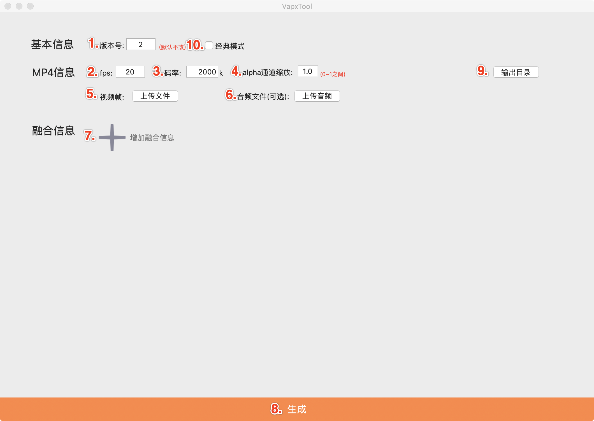
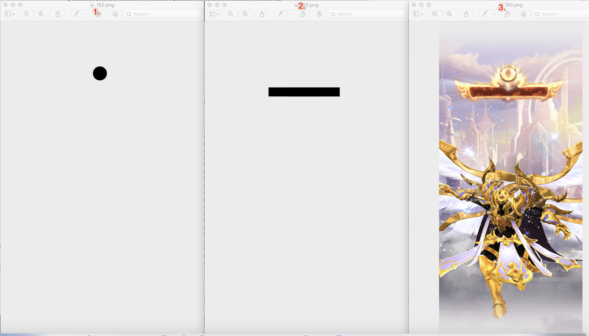

# VAPXTool 

## 简介
vapxTool是专门为vap组件打造的素材生成工具

Mac安装包下载：[download](https://github.com/Tencent/vap/releases/download/iOS1.0.3/VapxTool.dmg)

Java版本(支持Windows & Mac): [VapTool_Java.md](./README.md)

## 功能介绍

### 基本操作

1. 版本号 - 默认为2，一般情况不需要改
2. fps - 定义素材播放的帧率
3. 码率 - 定义mp4中h.264 的码率 同一份素材，码率越高清晰度越高，文件大小也会越大
4. alpha通道缩放 - 对素材中alpha数据进行压缩，以减少素材大小和显存占用。建议值0.5，数值越低质量越低
5. 视频帧 - ！！！！重要！！！！特效的帧素材，命名必须以固定长度的数字递增例如（000.png, 001.png, ...）
6. 音频文件 - 可选，特效素材可以支持音频播放
7. 融合信息 - 可选，增加融合效果，可以对静态素材增加网络图片或者自定义文字等。详细见 增加融合信息。
8. 生成按钮 -  点击开始生成
9. 输出目录 - 点击打开输出文件，mp4文件即为vap文件，使用这个文件即可；vapc.json文件是给前端用的，实际上就是已经编码在mp4的vap配置信息
10. 经典模式开关 - 为企鹅电竞旧版本所需的非融合素材提供的兼容模式，外部团队可以不需要关注。具体区别在于打开兼容模式后- (1).帧素材的长或宽必须是16的倍数，否则直接失败；(2).alpha通道不能缩放，系数锁定为1 (3).无法增加融合信息 (4).alpha和rgb纹理之间没有缝隙，紧密排布。

-------- 如果不需要融合信息的话 不需要关注以下操作 ------------

### 增加融合信息

1. 占位符 - 用以标示该融合资源。例如图片的话建议命名为[img0],[img1],[img2],... 文字则建议命名为[txt0],[txt1],...；这都不固定，与开发约定好就可以了。
2. 资源类型 - 目前支持1.网络图片 2.文字 两种类型
3. 适配类型 - 铺满：资源会按照容器大小（在遮罩中指定）拉伸 等比适配 - 默认按资源尺寸展示，如果资源尺寸小于遮罩，则等比放大至可填满
4. 宽高尺寸 - 宽高像素值，这里定义的是资源的宽高大小并不是最终展示的大小；影响像素质量。
5. 上传遮罩 - ！！！！重要！！！！命名要求与视频帧一样！且可以不连续但是命名一定是对应的帧数值。例 003.png指的是第四帧对应的遮罩。以下补充遮罩文件的说明：

#### 遮罩文件说明
例：

图中 1 2标示两组遮罩（1是头像遮罩 2.标示文字遮罩）中的150帧的遮罩，3表示对应的视频帧内容
注意点：
1. 遮罩帧的尺寸必须与视频帧一致
2. 黑色表示显示，红色表示遮挡；

效果图：

### 额外说明
1. 为了提高在Android设备上的兼容性，对生成的素材长宽进行16倍率处理，即生成的素材长宽必然是16整数倍
2. 为了消除视频编码算法对遮罩/原视频边缘的影响，遮罩/原视频周边会预留4像素，即遮罩/原视频与边缘间隔4像素，遮罩/原视频与遮罩/原视频间隔8像素；特别地，当遮罩/原视频宽度不小于最大长度（1504）时左右间距为0；当遮罩/原视频高度不小于最大长度(1504)时上下间距为0
