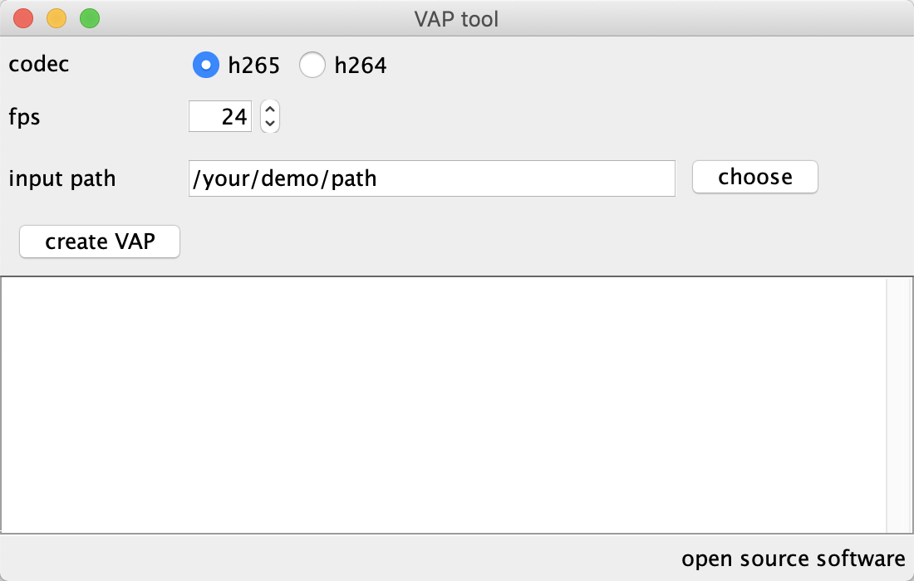
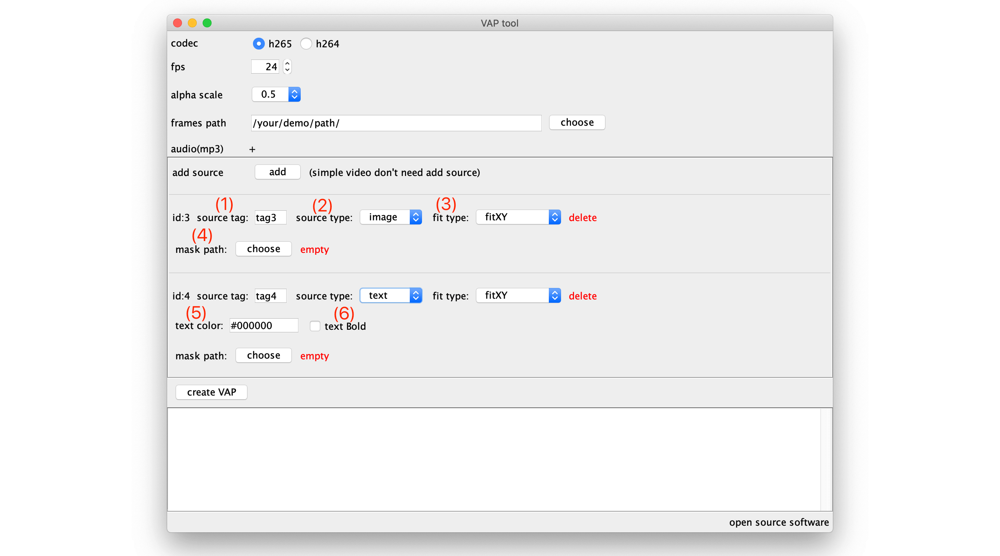

# VapTool

VapTool Java版本支持 Windows 与Mac

版本: [tool2.0.2](https://github.com/Tencent/vap/releases/tag/tool2.0.2)

os|download|description
---|---|---
Windows|[VapTool\_Java\_Win\_Full.zip](https://github.com/Tencent/vap/releases/download/tool2.0.2/VapTool_Java_Win_Full.zip)|包含jre 可直接运行
Mac|[VapTool\_Java\_Mac\_without\_jre.zip](https://github.com/Tencent/vap/releases/download/tool2.0.2/VapTool_Java_Mac_without_jre.zip)|未含jre 但Mac基本自带java 

运行包中包含其它工具，可以单独下载jar文件，替换后运行：

download jar: [animtool_tool2.0.2.zip](https://github.com/Tencent/vap/releases/download/tool2.0.2/animtool_tool2.0.2.zip)


## Windows

双击此文件运行

```sh
win_start.bat
```

## Mac

需要打开终端命令行，进入到工具目录执行以下命令

检查 & 初始化工作
```sh
// 先检查是否已经安装java
// 如未有版本信息输出，请先安装java
java -version

// 检查mac文件夹下 ffmpeg 与 mp4edit 工具是否有执行权限，没有权限请赋予运行权限
./ffmpeg -version
./md4edit -v

// 赋予脚本可执行权限（只需要执行一次）
chmod +x mac_start.sh

```

启动工具
```sh
./mac_start.sh
```

## 工具说明



* codec: 编码类型(默认h264)
 	* h264: **优点**: 兼容性好，几乎所有机器都能播放；**缺点**: 压缩率没有h265高;
	* h265: **优点**: 压缩率更高，画面更清晰；**缺点**: Android 4.x 版本无法播放，部分低端机器兼容性差; Web端浏览器可能不支持h265;

* fps: 每秒播放多少帧;
* bitrate: 设置视频码率，默认2000k，数字越大越清晰，但文件也越大;
* alpha scale: 视频alpha区域是否缩放(默认缩放0.5)，目前可选: 缩放0.5;不缩放1. 缩放视频能最终减小视频分辨率，提高兼容性;
* frames path: 视频帧存放的位置
	* 视频帧命名方法 **000.png 001.png ... 099.png**。第一帧一定是**000.png**不然无法正常生成，可以参考"simple_demo";
	* 点击"choose"弹窗是文件夹选择器，目的是选择视频帧所在文件夹路径
* audio: 需要集成到视频里的声音文件(目前支持mp3文件).

普通VAP视频完成以上配置即可.
 
点击"create VAP" 开始生成视频.


### 文件输出
* video.mp4: 最终生成的视频文件
* vapc.json: web端配置文件
* md5.txt: video.mp4的md5，可以做文件校验
* frames: 临时图片文件

## 进阶：融合动画
ps：普通动画不需要此设置



* 点击"add"按钮添加融合动画遮罩信息

* (1) source tag: 占位符标示，相当于当前资源的一个字符串标志，播放融合动画时，根据不同的tag 返回不同 bitmap 用于显示;

* (2) source type: 表示属性类型，目前支持两种 image(图片), text(文字);

* (3) fit type: 图片显示时的方式，目前支持两种 fitXY(图片平铺 default), centerCrop(比例缩放)，这几个概念与Android里图片对其方式概念相同;

* (4) mask path: 遮罩图片路径;

* (5) text color: 如果是文字类型，设置文字颜色，格式: #000000

* (6) text Bold: 如果是文字类型，设置文字是否为粗体

注意：使用融合动画 alpha scale 会强制设置为 0.5 因为需要给遮罩预留空间

### 遮罩图片说明
例：


图中 1 2标示两组遮罩（1是头像遮罩 2.标示文字遮罩）中的150帧的遮罩，3表示对应的视频帧内容
注意点:

1. 遮罩文件命名规则，与视频帧相同**000.png 001.png ... 099.png**，文件名表示当前遮罩属于哪一帧;

2. 遮罩帧的尺寸必须与视频帧一致;

3. 遮罩内容: 黑色区域表示图片(文字)需要显示的位置，其它区域透明度必须为0 (黑色区域内的红色表示遮挡区域);

可以参考"vapx_demo"

效果图:


## 其它说明

欢迎大家一起来完善Java版本功能. 

Java工具源码路径:Android/PlayerProj  项目：[animtool](https://github.com/Tencent/vap/tree/master/Android/PlayerProj)

原Mac工具说明[Mac tool](./Mac_Tool.md)

VAP json配置信息字段说明[Image](images/vap_field_info.png).

## FAQ

[常见问题说明](https://github.com/Tencent/vap/wiki/FAQ)

