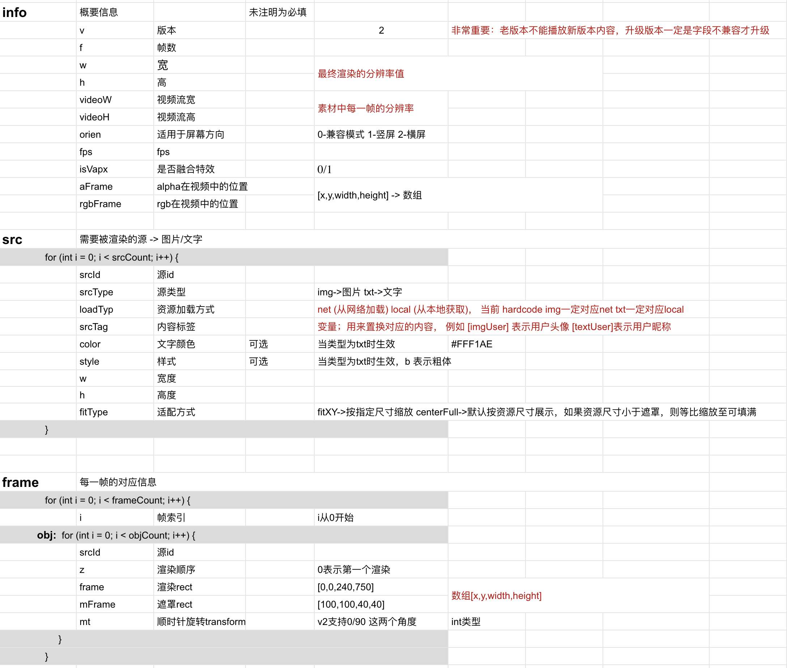

# VapTool

VapTool Java版本支持 Windows 与Mac

OS|download
---|---
Windows|[VapTool\_Java\_Win\_Full.zip](https://github.com/Tencent/vap/releases/download/v1.0.0/VapTool_Java_Win_Full.zip)
Mac|[VapTool\_Java\_Mac\_without\_jre.zip](https://github.com/Tencent/vap/releases/download/v1.0.0/VapTool_Java_Mac_without_jre.zip)

### 注意
Java版本支持能力：

1. 基础透明视频输出;
2. 支持H265视频输出;

未支持能力：

1. 不支持融合动画;
2. 不支持音频合成;
3. 不支持alpha区域按比例缩放;

## Windows

双击此文件运行

```sh
win_full_start.bat
```

## Mac

需要打开终端命令行，进入到工具目录执行以下命令

```sh
// 先检查是否已经安装java
// 如未有版本信息输出，请先安装java
java -version

// 赋予脚步可执行权限（只需要执行一次）
chmod +x mac_start.sh

// 启动工具
./mac_start.sh

```

## 工具说明


* codec: 编码类型(默认h265)
	* h265: 优点：压缩率更高，画面更清晰；缺点：Android 4.x 版本无法播放，部分低端机器兼容性差
	* h264: 优点：兼容性好，几乎所有机器都能播放；缺点：压缩率没有h265高
* fps: 每秒播放多少帧
* input path: 视频帧存放的位置
	* 视频帧命名方法 **000.png 001.png ... 099.png**。第一帧一定是**000.png**不然无法正常生成，可以参考"非融合特效demo"

点击"create VAP" 开始生成视频。

### 文件输出
* video.mp4: 最终生成的视频文件
* vapc.json: web端配置文件
* md5.txt: video.mp4的md5，可以做文件校验
* frames: 临时图片文件

## VAP字段说明

欢迎大家一起来完善Java版本功能，下表为VAP json配置信息字段说明。



